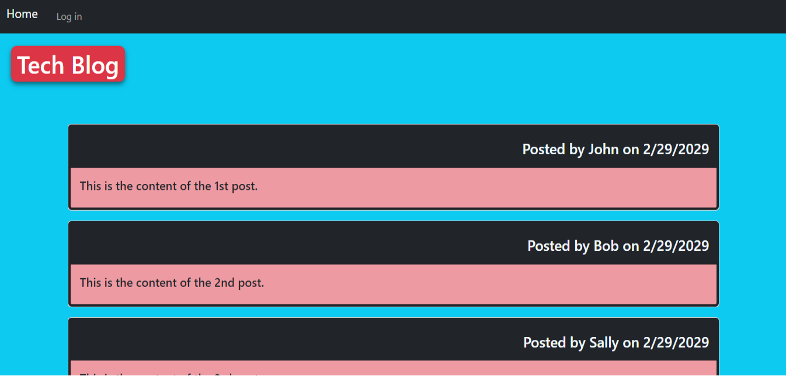

# Tech Blog

A full-stack blog application built with the MVC (Model-View-Controller) architectural pattern, allowing developers to publish blog posts and engage in technical discussions.

## Features

- **User Authentication**
  - Secure signup and login functionality
  - Password hashing with bcrypt
  - Session-based authentication
  - Protected routes for authenticated users

- **Blog Management**
  - Create, read, update, and delete blog posts
  - Rich text content support
  - Post metadata including author and creation date
  - Dashboard for managing personal posts

- **Interactive Comments**
  - Comment on blog posts
  - Real-time character counter
  - Delete comments (for comment authors)
  - Nested comment display

- **Responsive Design**
  - Mobile-first approach
  - Bootstrap integration
  - Custom CSS with CSS variables
  - Dark mode support

## Usage

1. **Sign Up/Login**
   - Create a new account or login with existing credentials
   - Passwords must be at least 8 characters long

2. **View Posts**
   - Browse all blog posts on the homepage
   - Click on individual posts to view full content and comments

3. **Create Posts**
   - Navigate to Dashboard
   - Click "Create New Post"
   - Fill in title and content

4. **Manage Posts**
   - Edit or delete your own posts from the Dashboard
   - View comments on your posts

5. **Comment**
   - Leave comments on any post when logged in
   - Character limit of 500 per comment
   - Delete your own comments

## Technology Stack

### Backend
- **Node.js & Express.js** - Server and API framework
- **MySQL & Sequelize ORM** - Database and modeling
- **Express-Session** - Session management
- **Express-Handlebars** - Template engine
- **Bcrypt** - Password hashing
- **Dotenv** - Environment variable management

### Frontend
- **Bootstrap** - UI framework
- **Custom CSS** - Styling with variables and responsive design
- **JavaScript** - Client-side interactivity
- **Handlebars.js** - Dynamic template renderin

## Getting Started

1. Clone this repository.
2. Install dependencies (`npm install`).
3. Set up your MySQL database.
    1. Create a `.env` file in the root directory with the following variables:
    ```
    B_NAME='tech_blog_db'
    DB_USER='your_mysql_username'
    DB_PW='your_mysql_password'
    SESSION_SECRET='your_session_secret'
    ```
    2. Set up the database:
    ```
    mysql -u root -p
    source db/schema.sql
    quit
    ```
    3. Seed Database (`npm run seed`).
 
4. Start the server (`npm start`).
5. Visit `http://localhost:3001` in your browser.


## Project Structure

```
MVC-Tech-Blog/
├── config/          # Database and middleware 
├── controllers/     # Route handlers
├── db/             # Database schema
├── models/         # Sequelize models
├── public/         # Static assets
├── utils/          # Helper functions
├── views/          # Handlebars templates
└── server.js       # Application entry point
```
## Screenshot



## License

ISC License

